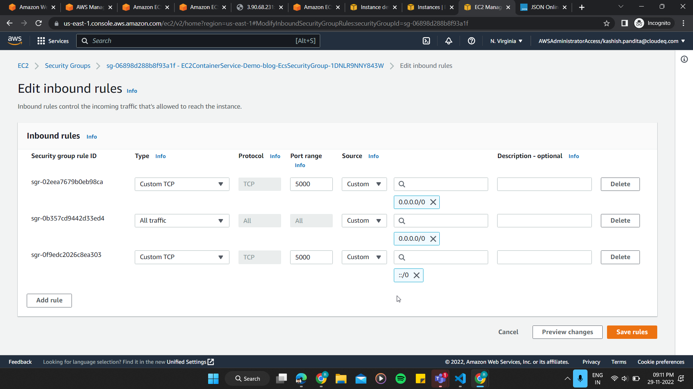

# How to deploy application to ecs cluster and connect the application logs to new relic through firelens(fluent-bit)

## Pushing docker image to ecr

1. Create Dockerfile for application
2. Go to Amazon Elastic Container Registry -> public -> create repository -> give name for repo in details section -> create repository
3. Go to created repo -> view push commands -> follow the steps
4. go to created repo -> click on the pushed docker image -> copy the uri

## cluster creation

5. Create ECS cluster -> EC2 Linux + Networking -> Give cluster name -> ec2 instance type(atleast) -> create/select vpc -> create/select subnet -> create/select security group -> create

## Task definition

6. Go to Task definition -> create new task -> ec2 -> Next step
7. Configure Via JSON

### json code

```json
{
  "family": "newrelic-firelens-go-demo", # task definition
  "networkMode": "bridge",
  "requiresCompatibilities": ["EC2"],
  "containerDefinitions": [
    {
      "essential": true,
      "image": "533243300146.dkr.ecr.us-east-1.amazonaws.com/newrelic/logging-firelens-fluentbit", # see new relic docs for fluent bit image id for different regions
      "name": "demo_container",
      "memoryReservation": 50,
      "firelensConfiguration": {
        "type": "fluentbit",
        "options": {
          "enable-ecs-log-metadata": "true"
        }
      }
    },
    {
      "essential": true,
      "name": "webserver",
      "image": "public.ecr.aws/b6j7n2e6/go-demo:latest", # docker image url which is pushed ecr
      "cpu": 512,
      "memoryReservation": 1024,
      "portMappings": [
        {
          "containerPort": 8080 # port number which was given in application
        }
      ],
      "environment": [
        {
          "name": "VERSION",
          "value": "V1"
        }
      ],
      "logConfiguration": {
        "logDriver": "awsfirelens",
        "options": {
          "Name": "newrelic",
          "apiKey": "b418de86fea2476a521a8f78e410d33421f4NRAL" # our new relic license key
        }
      }
    }
  ],
  "taskRoleArn": "arn:aws:iam::676634049556:role/ecsTaskExecutionRole", # aws account id = 676634049556
  "executionRoleArn": "arn:aws:iam::676634049556:role/ecsTaskExecutionRole", # aws account id = 676634049556
  "cpu": "1 vcpu",
  "memory": "2 gb"
}
```

## running task definition in cluster

8. Go to cluster -> tasks -> run new task -> select launch type(Ec2) -> select the task definition and cluster -> run task
9. Then go to cluster -> ecs instances -> select the instance running -> go to instance -> security -> security group -> edit inbound rules ->
   

10. go to cluster -> task -> select the task -> select the web server -> here we can see the ports and External Link for accessing the application
11. Open the application in new tab -> wait for the logs -> go to new relic -> logs.
